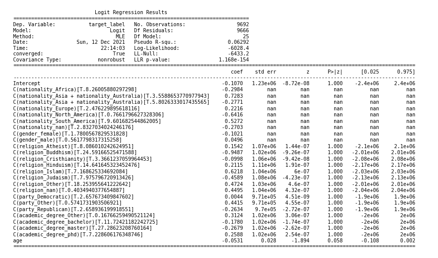
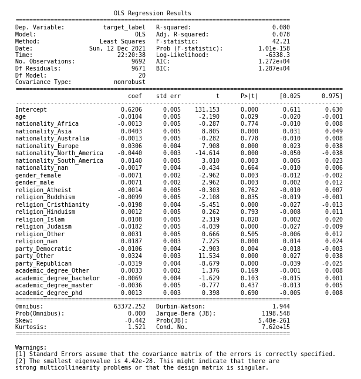

# Introduction

## Abstract

In the 21st century *media coverage* is a crucial factor for political figures. The public is “meant” to believe everything they are told and not question it, so that people are easily convinced by what they read on newspapers, news websites or social media. Therefore it could be of primarly interest to study and understand *media interest* in different politicians over a specific time period since this interest is capable of influencing the thoughts of billions of people.

## Methods

We could have a rough measure of the above mentioned interest by studying the number of quotes published on newspapers or news websites referred to a given politician on a given period.
In our analysis we will focus on the years 2015-2017 and we will:
* discuss and analyze the evolution of the number of quotes referred to two of the main politicians of the American scene over the past few years: Donald Trump and Hillary Clinton.
* tell the story of the American political scene of these years by comparing it to the evolution of the number of quotes referring to the two politicians; we will identify which factors caused the peaks in the number of quotes or a lack of them.
* compare the media popularity of the two politicians over the years 2015-2017.
* compare our results with Google Trends to see if the conventional media outlets capture the online interest as well.
* try to understand which are the main differences between the speakers whose quotes refer to Trump and the one whose quotes refer to Clinton. 

## Data in numbers

For our analysis we used Quotebank dataset containing 178 million unique, speaker-attributed quotations that were extracted from 196 million English news articles crawled from over 377 thousand web domains between 2015-2020. After a careful selection of the quotes we could be able to collect the following data for our analysis.

| Politicians      | Data |
| :---        |    :----:   |
| Donald Trump     | More than 450000 quotes referred to him from more than 30000 different speakers |
| Hillary Clinton   | More than 60000 quotes referred to her from more than 8000 different speakers |
{: .tablelines}

## Analysis of the evolution of the number of quotes

First of all, let's take a look at the general trend of the number of quotes of the two political opponents over the years 2015-2017, feel free to interact with the plot to discover useful information. The first question which might arise spontanously is the following: who has the bigger number of quotes ? Does it relate to the politician popularity ?

<iframe src="General_timeseries_comparison.html" width="120%" height="600">  </iframe>

As we can observe, generally speaking the number of quotes related to Trump is bigger than the number of quotes related to Cliton, but there are some periods in which this is not the case (for example at the beginning of 2015). In addition, as a general trend, we can observe that Clinton number of quotes has decreased a lot from September 2016 until the end of 2017 while the opposite is true for Trump. Which factors are related to this trends ? We will answer this question by describing the main political events in the life  of the two opponents during the years 2015-2017 understanding how these events influenced their media popularity.

### Year 2015: The rise of Trump consent

At the beginning of 2015 Hillary Clinton was very well known in the United States since she had already covered several political positions such as being the first lady of the United States (1993-2001), being an US senator from New York (2001-2009) and serving as the United States Secretary of State (2009-2013). On the other hand, Donald Trump was mostly known at the beginning of 2015 as a business man and it was not until June 2015 that he announced  his entrance into the race for the White House. But 2015 has been a year often considered a turning point in the recent American political scene since we assist to a rapid increase in Trump popularity and consent.
We will have a look at the number of quotes referring to the two politicians over the course of the year 2015.

<head>
     <link href="https://cdn.jsdelivr.net/npm/bootstrap@5.0.0-beta3/dist/css/bootstrap.min.css" rel="stylesheet"
         integrity="sha384-eOJMYsd53ii+scO/bJGFsiCZc+5NDVN2yr8+0RDqr0Ql0h+rP48ckxlpbzKgwra6" crossorigin="anonymous">
<title>1st Analysis</title>
      <link rel="shortcut icon" type="image/jpg" href="python-logo.png"/>
   </head>
<iframe src="both_timeseries_2015.html" width="120%" height="600">  </iframe>

The number of quotes at the beginning of 2015 reflects perfectly the popularity of the two politicians, Trump has very few quotes referring to him until the half of May while Clinton has a much more consistent number of quotes referred to her from the beginning of 2015.

Apparently, until the summer a very small visibility was given to Trump in media while Clinton visibility was quite high during that period, with some small peaks at the beginning of March and at the beginning of April. The two small peaks are probably caused by the controversy arisen in March 2015 when the State Department's inspector general revealed that Clinton had used personal email accounts on a non-government, privately maintained server exclusively, instead of email accounts maintained on federal government servers when conducting official business during her tenure as secretary of state. This event will mark the political carreer of Hillary and will be one of the main discussion points during the debates for the 2016 elections.

Despite the initial lack of quotes referring to Trump, he succeeded to capture an increasing media attention from the beginning of July this is why this period has often been called the summer of Trump. Indeed, Trump announced he was going to candidate as the president of the United States the 15th June 2015 (small peak in the timeseries) and from that moment his consent started to rise. According to researches, his approval rating spiked on 12 July 2015, when he accused Mexicans of "killing us at the border" at a mass rally in Phoenix.

Eight days later his polling average climbed to 16.8% (slightly before the first detected peaks in the timeseries). We also observe that the second detected and third peak for Trump and other minor peaks for Clinton are respectively in the weeks of the first and second republican debate held the 7th of August and the 17th of September. As we can observe, despite the peaks are visible for both the opponents, the Trump's one are bigger. This shows how his character captured more the interest of the media compared to Hillary Clinton. For instance the famous speech against terrorism pronounced by Clinton the 11th November 2015 (first detected peak for Clinton) grabbed some attention but the controversial want of Trump of banning all the muslim entering US (8th December 2015) did it in a way more substantial way.

### Year 2016: The year of the truth

The 2016 year was the decisive year for the future of the United States of America since the 58th presidential election was held the 8th November of 2016. Nobody had a clear answer at the question "who will win the next elections ?": even if Trump took a great advantage on the opponent during the summer of 2015, Clinton could count on the historical support of a great amount of Americans. The year 2016 and in particular the few month before elections have been a turning point in the result of the 2016 elections. Which events grabbed the most the media attention during this year ?

<iframe src="both_timeseries_2016.html" width="120%" height="600">  </iframe>

We can observe that the distribution of the number of quotes about the two politician is quite varied: there are some weeks in which the number of quotes is almost zero while in some other weeks there are peaks of thousands of quotes. Moreover we observe that the distribution is very similar for the two politicians: when one politician has very few quotes the other has very few quotes too and the same is for the peaks. Why this happens ? Which events has influenced this distribution ? How did they influence the election results ?

The media interest in Trump the week the 21th february 2016 could probably be related to the feud between Trump and pope Francis (18 February). The pope indeed pronounced the following words "A person who thinks only about building walls, wherever they may be, and not building bridges, is not Christian." and Trump responded quickly to the pontiff "No leader, especially a religious leader, has the right to question another man’s religion or faith.”. In the following months Trump continued his political campaign attacking the rival: Trump called his likely opponent "unqualified", and said she "should suffer" for her use of a private email server in the beginning of May (big peak for both Trump and Clinton). On top of that a few days after, precisely the second of May, Trump accused China of "raping" US with her trade policy and this event had also for sure grabbed media attention.

The main political events which happened in the following months were the Republican and Democratic national conventions respectively the 18th-21th of July and the 25th-28th of July (two highest peak of the year). In the Republican national convention Trump won the party’s nomination to Republicans’ disbelief,, Trump accepted the party nomination: “Nobody knows the system better than me, which is why I alone can fix it.”. During the Democratic one Clinton became the first woman to accept the nomination of a major party in the US: “Standing here as my mother’s daughter, and my daughter’s mother, I’m so happy this day has come.” She added: “When any barrier falls in America, for anyone, it clears the way for everyone.”. From that moment on the two rivals were decided and the following months, marked by public debates, have been decisive for the result of the elections. The first presidential debate was held the 26th September in New York. It was the most watched debate in American history, with at least 80m people tuning in. Clinton came prepared, Trump not so much. She baited him with charges of racism, sexism and tax avoidance and he took the bait.
After the first and the following debates everything was set up: people only had to vote and to wait for the results. Election day arrived soon (8th November 2016). With a big surprise Trump defeated the opponent Hillary Clinton despite Clinton received a slightly higher number of votes. From that moment on Clinton's popularity has decreased a lot in media quotes while Trump's one has increased drastically right after the elections with a great interest of the media on him around the 15th of December.

### Year 2017: The rise of a new discontent

After the defeat of Clinton in 2016 elections, Trump was inaugurated as the 45th president of the United States on January 20, 2017. How his early actions influenced the mediatic interest on his character ? Let's have a look at the timeseries.

<iframe src="both_timeseries_2017.html" width="120%" height="600">  </iframe>

As we can observe the mediatic popularity of Clinton measured by the number of quotes dropped drastically, on the other hand, Trump's one has generally increased with respet to the two previous years. This could be caused by the fact that the first year of presidency has been full of a variety of controversies involving Trump.

One day after being sworn in as the 45th president of United States (21th Jan), the Women’s March took place. This worldwide protest was prompted by the fact that several of Trump's statements were considered by many as anti-women or otherwise offensive to women, shortly after, the 27th of Jan, Trump signed the first travel ban executive order, halting Syrian refugees and barring citizens from seven countries for 90 days. This events, and other controversies in the first two weeks, led to the first peak(beginning of February) in the Trump timeseries. Another protest happens the 16th February the so called Day Without Immigrants 2017 protests held throughout the United States to demonstrate the importance of immigration. This other protest is probably the cause of the other spike in the Trump timeseries in the third week of February.

We continue then to assist to an increase of number of quotes referred to Trump while the one related to Clinton stays close to zero until the second week of May, indeed the 3rd of May Hillary Clinton was the featured speaker at the Women for Women International were she among other topics, blamed Russian interference in the US election for her loss and 10th the meeting of Trump and the Russian Foreign Minister Ambassador took date.

Th biggest peak in the number of quotes referred to Trump was during the third week of August, indeed in that period (the week before) the Unite the Right rally: a white supremacist rally took place in Charlottesville, Virginia. Far-right groups participated, including self-identified members of the alt-right, neo-Confederates, neo-fascists,white nationalists and neo-Nazis. Some groups chanted racist and antisemitic slogans and carried weapons, Nazi and neo-Nazi symbols. Despite Trump condamned the acts in Charlottesville, many people linked the participants of the rally to Trump supporters and the discontent started to rise.

At the end of august 2017, according to the results of the poll of NCB news:
* 39 percent of Americans approve of Trump’s job as president (compared with 59 percent who disapprove)
* 36 percent have a favorable impression of the president (versus 61 percent with an unfavorable view)
* 38 percent believe immigration hurts the country more than it helps (versus 57 percent who think it helps more than it hurts)

Therefore, despite the number of quotes referring to Trump in 2017 is high, most of them are due to the fact that some controvertial facts happened in the United States during that period. This shows that having a great mediatic interest does not always mean that the character is appreciated by the population.

### Google Trends comparison

According to recent studies of Pew Research center about half (48%) of U.S. adults say they get news from social media “often” or “sometimes”. As a consequence, nowadays, it is not sufficient anymore to study the popularity of a given character on media but it could be useful to study his popularity also in social medias and more in general online. Therefore, a question which might arise spontanously is the following: is the mediatic interest linked to the online interest ? To answer this question we will use Google Trends data. Google Trends is a website by Google that analyzes the popularity of top search queries in Google Search across various regions and languages. The website uses graphs to compare the search volume of different queries over time.

We will compare the evolution of the number of quotes during the years 2015-2017 for both Clinton and Trump with Google Trends number of searches in Google of the two politicians in the United States area. For the sake of simplicity we will consider only Trump quotes and Trump trends.

<iframe src="google_trends_comparison_Trump.html" width="120%" height="1550"> </iframe>

As we can observe, in 2015 the two curves behave in a similar way. However the same is not true for the years 2016-2017. This is probably caused by the fact that the years 2016 and 2017 are quite special when it comes to Trump. For example in 2016 we observe a great amount of quotes before election periods and a few quotes during election period while the opposite is true when it comes to Google Trends plot. The reason which could explain the behaviour of the two distributions could lie on the fact that even if linked, the mediatic interest and the number of queries are not totally related. For instance, in that case, mediatic attention rose more for previous debates than for election while online interest rose more right after the elections. A similar resoning apply to 2017: events such that the Women’s March are able to attract more the online attention (also thanks to social media) while often this is not the case for newspapers or news websites.

## Analysis of speaker attributes

In order to provide a complete description of the popularity of a politician, it's of the utmost importance to have an in-depth analysis of the characteristics of the individuals that talk about this political figure. Afterwards we'll provide a data driven analysis focused on describing the **Age**, , the **Gender**, the **Ethnicity** and the **Nationality** of Trump and Clinton speakers.

### Age

According to conventional wisdom people tend to become more conservative as they grow older, recently the *University of Chicago Press* elaborated a study that tries to access if the convential wisdom holds and how much so, in our work we will take a look at how the distribution of ages of Conservative Republican Donald Trump relates to the distribution of ages of his counterpart Democrat Hillary Clinton, do you think the conventional wisdom holds? Let's take a look!

##### Trump Age Distribution

<iframe src="Trump_Age.html" width="120%" height="500">  </iframe>

As we observe the median age of a Trump speaker is 59 years old, interestingly the interquartile range is only 21 years with the first quartile ending at 48 years old and the third quartile ending at 69 years old, therefore 75 % of the speakers have more than 48 years. Another interesting observation relates to the skewness of the curve in the right and left sides of the distribution, it's noticeable that the skewness is slightly bigger on the right side compared to the left side, one possible explanation is the inherent biological restrictions of the human body, since the global live expectancy is calculated to be around 72 years old.

##### Clinton Age Distribution

<iframe src="Clinton_Age.html" width="120%" height="500">  </iframe>

As we observe the median age of a Clinton speaker is 60 years old, interestingly the interquartile range is only 22 years with the first quartile ending at 49 years old and the third quartile ending at 71 years old, therefore 75 % of the speakers have more than 49 years. Following the reasoning from the Trump Distribution, here one can also see that the right side of the distribution is more skewed than the right side, however the higher median and third quartile values mean the biological restriction will be even more visible, therefore having a skewness much higher in compared to the left side.

##### Age Comparison

<iframe src="Clinton_Trump_Age.html" width="130%" height="900">  </iframe>

From the distribution it could seem that Clinton's speakers are a bit older in general with respect to Trump's speakers, since as we mentioned before Trump's median is one year less than Clinton's median and the third quartile value is two years less than Clinton's as well. Additionally it's also notable that the age distribution deviates from the Authors distribution, maybe we can reason that people in their 40s, 50s and 60s are more prone to talk about politics, maybe one of the reasons why this happens relates to younger people not having enough knowledge of the recent political history, in order to correclty access the state of the country, and older people are not as prone to spend energy talking about such complex topic.

##### Is the difference statistical significant?

Technically by computing a *Student t-test* for both distributions we can compute the p-value of the null-hypothesis stating that the two distributions have the same mean. One can do this computation and see that the p-value is 2.3e-05, conventionally with such a low p-value it's often stated that we can reject the null hypothesis, therefore implying the difference to be statistically significant. In the end, we can conclude that on average the age of Trump speaker is smaller than the average of a Clinton speaker, therefore if we assume people talk more often about the people they support, this would be contradicting the conventional wisdom. However, recently there is an increasing amount of critique surrounding the speech of most authors, so we can be observing the inverse pattern, where a Trump Speaker would be more likely to be supporting Clinton, in this case the conventional wisdom would hold true. To sum up the data doesn't provide insights on the accuracy of the conventional wisdom.

### Gender

Nowadays, the relationship between gender and politics is a very hot topic. The study of gender and politics focus on how peoples' genre determines their participation in and experience of political events. One of the central concerns of this topic relates to the exclusion of women from politics, it's clear that the participation is not equal, therefore most democratic societies are focusing on changing the current situation. Should we expect different ratios from men and women to contribute in politics? What's the current situation in terms of numbers? Let's see!

##### Trump Gender Distribution

<iframe src="Trump_gender.html" width="120%" height="500">  </iframe>

Given the number of males and females speaking about Trump, we clearly see a 3.23 male / female ratio, this means for every female that speaks about Trump we have on average 3.23 males speaking about Trump.

##### Clinton Gender Distribution

<iframe src="Clinton_gender.html" width="120%" height="500">  </iframe>

Given the number of males and females speaking about Clinton, we clearly see a 2.80 male / female ratio, this means for every female that speaks about Clinton, we have on average 2.8 males speaking about Clinton.

##### Gender Comparison

<iframe src="Clinton_Trump_gender.html" width="120%" height="500">  </iframe>

As we can see the percentage of men talking about Trump is very similar to the Author Distribution, which means that talking about Trump even though it's maioritarily done by men doesn't reflect a big deviation from the distribution seen on other topics. However, interestingly talking about Clinton deviates a lot from the Author Distribution and from talking about Trump, one possible explanation for this phenomena can relate to the feminist movement, since Hillary Clinton would be the first female President of the US.

##### Is the difference statistical significant?

We computed the 5 % confidence intervals for Trump and Clinton ratio of gender, since we got [2.61, 3.01] for Clinton and [3.01, 3.37] for Trump, we can easily spot that the two confidence intervals don't overlap, therefore the difference in ratios is statistically significant.

### Ethnicity

##### Trump Ethnicity Distribution

<iframe src="Trump_Eth.html" width="100%" height="500">  </iframe>

##### Clinton Ethnicity Distribution

<iframe src="Clinton_Eth.html" width="100%" height="500">  </iframe>

##### Ethnicity Comparison

<iframe src="Eth_Pie_Chart.html" width="120%" height="700">  </iframe>

### Nationality

##### Trump Nationality Distribution

<iframe src="Trump_Nat.html" width="100%" height="500">  </iframe>

##### Clinton Nationality Distribution

<iframe src="Clinton_Nat.html" width="100%" height="500">  </iframe>

##### Nationality Comparison

<iframe src="Clinton_Trump_Nat.html" width="100%" height="500">  </iframe>

## Machine Learning Interpretable Models

In order to better interpret what features can be consider predictive, when classifying an author as either a Trump Speaker or a Clinton Speaker, we will train a **Logistic Regression** and a **Least Squares** models.

### Logistic Regression Model

Logistic Regression is usually the better model for classification tasks, however as we can see the results are not great, since we have a big number of non defined values coupled with very high p-value for most coefficients. That being said we can't make any meaningful conclusions, unless for the age predictor.

##### Model Conclusions

By looking at the coefficients with low p-value and their respective sign we can make the following conclusions:

- A negative coefficient in the age features tells us that a higher age is more common for Clinton speakers (matches the conclusion in the age analysis), hence we can conclude that the feature is a positive predictor for Clinton speakers and a negative predictor for Trump speakers  

### Least Squares Model

Least Squares typically is used for regression tasks, however it can be quite indicative of a predictor if look at the sign of the coefficients with low p-value. Fortunately the regression analysis provides better results than the previous analysis, allowing us to make some conclusions.

##### Model Conclusions

By looking at the coefficients with low p-value and their respective sign we can make the following conclusions:

- Like before, age is a positive predictor for Clinton Speakers and a negative predictor for Trump speakers
- Nationality from Europe, Asia and South America are positive predictors for Trump Speakers and negative predictors for Clinton Speakers
- Nationality from North America is a positive predictor for Clinton Speakers and a negative predictor for Clinton Speakers
- Male gender is a positive predictor for Trump Speakers, conversely Female gender is a positive predictor for Clinton Speakers
- In terms of religion, believing in Buddism, Christianity, Judaism are positive predictors for Clinton Speakers, whereas believing in Islam or not declaring any religion can be seen as positive predictor for Trump speakers
- Surprisingly both being a democrat or a republican is a positive predictor for Clinton speakers
- Not belonging to the democrats and republicans, but to other political party is a positive predictor for Trump speakers

Note: We considered the 6 % significance level for our analysis.  

## Conclusion

In this Project we provide a detailed analysis of the US political landscape from 2015 up to 2017, throughout our project we carefully look at the caracteristics of authors that talked about the two key political figures during that time (Donald Trump and Hillary Clinton), by looking at this two distinct groups we can reason about the two different basis around this two politicians and we can therefore think about the underlying differences between the democrat and republican basis. In the end, we create a model to predict wether or not someone is talking about Trump or Clinton, the results of the model can provide insights as to whether a person's caracteristic such as age or gender can be used as a predictor for the task at hand. To sum up our project's goal was to provide a detailed data centric view of the popularity and polarization of the aforementioned political figures for different groups of people.

